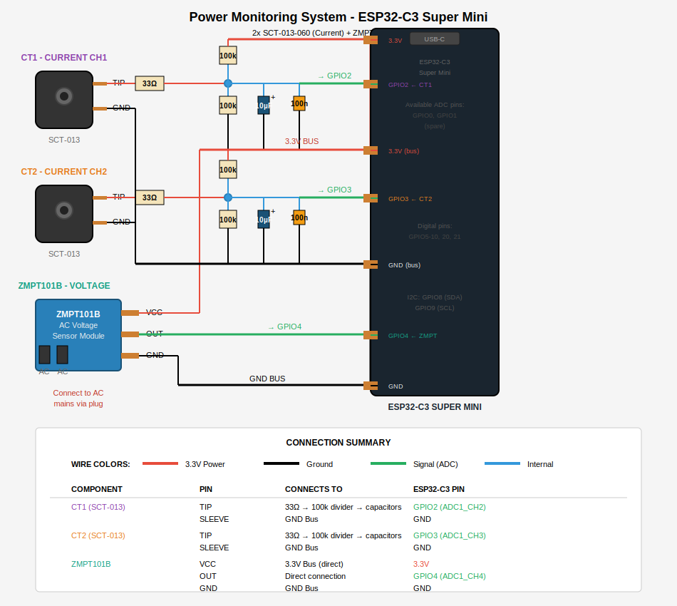

# Power Monitor using ESP32-C3 Super Mini

Home power monitoring system using 2x SCT-013-060 current transformers and a ZMPT101B voltage sensor with an ESP32-C3 Super Mini.

## Features

- Dual current monitoring (0-60A per channel) using SCT-013-060 CTs
- AC voltage monitoring using ZMPT101B sensor
- Sends readings via HTTPS POST as JSON every 5 seconds
- OTA (Over-The-Air) firmware updates over WiFi
- Per-batch DC offset removal for accurate RMS calculations
- Factory-calibrated ADC readings via `analogReadMilliVolts()`

## Circuit



### Components

- ESP32-C3 Super Mini
- 2x SCT-013-060 (60A/1V) current transformers with 3.5mm jacks
- 1x ZMPT101B AC voltage sensor module
- 4x 100kΩ resistors (voltage dividers for DC bias)
- 2x 33Ω resistors (protection)
- 2x 10µF capacitors (DC bias smoothing)
- 2x 100nF capacitors (high-frequency filtering)

### Pin Assignments

| Sensor | GPIO |
|--------|------|
| CT1 (Current Line 1) | GPIO2 |
| CT2 (Current Line 2) | GPIO3 |
| ZMPT101B (Voltage) | GPIO4 |

## Setup

1. Clone this repo
2. Copy `power_monitor/config.example.h` to `power_monitor/config.h`
3. Edit `config.h` with your WiFi credentials, server URL, and OTA password
4. Install [arduino-cli](https://arduino.github.io/arduino-cli/) and the ESP32 core:
   ```bash
   arduino-cli core install esp32:esp32
   ```
5. Compile and upload:
   ```bash
   arduino-cli compile --fqbn esp32:esp32:esp32c3:CDCOnBoot=cdc power_monitor
   arduino-cli upload --fqbn esp32:esp32:esp32c3:CDCOnBoot=cdc --port /dev/cu.usbmodem101 power_monitor
   ```

## OTA Updates

After the initial USB flash, future updates can be pushed over WiFi:

```bash
python3 ~/.arduino15/packages/esp32/hardware/esp32/*/tools/espota.py \
  -i power-monitor.local -a YOUR_OTA_PASSWORD -f power_monitor/build/power_monitor.ino.bin
```

## Calibration

Adjust these constants in `power_monitor.ino` against a reference clamp meter:

- `CT1_RATIO` / `CT2_RATIO` — Current transformer scaling factor
- `VOLT_CALIBRATION` — Voltage sensor scaling factor
- `CURRENT_NOISE_THRESHOLD` — Minimum current to report (filters ADC noise)
- `VOLTAGE_NOISE_THRESHOLD` — Minimum voltage to report

## API

Sends HTTPS POST every 5 seconds:

```json
{"v": 221.5, "i1": 8.12, "i2": 3.45}
```
